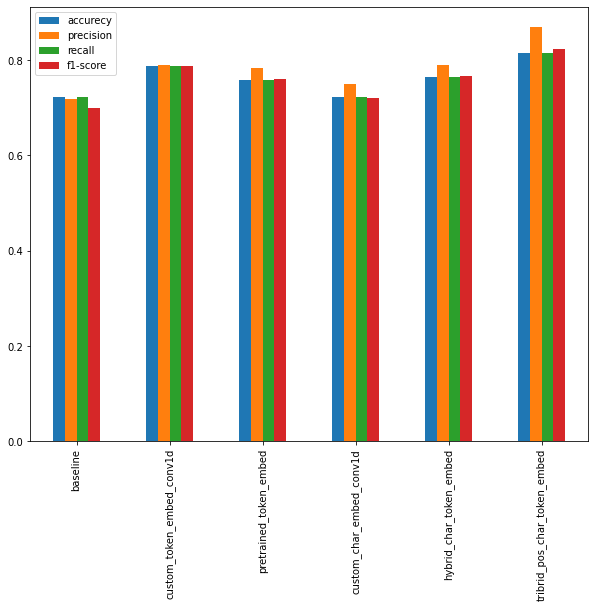
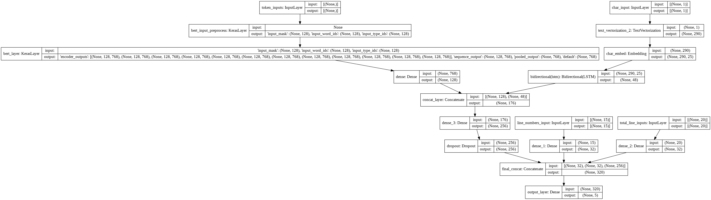

# SummarizeIt: Revolutionizing Research with AI

Dive into the heart of medical literature with ease. Our NLP model classifies abstract sentences into distinct roles, transforming the way researchers access and understand scientific papers.

## Project Overview

At the core of SummarizeIt is a sophisticated deep learning model, inspired by the groundbreaking 2017 paper ['PubMed 200k RCT'](https://arxiv.org/abs/1710.06071). This model is not just an imitation but an evolution, tailored to meet the dynamic needs of modern medical research.

## Dataset Utilized

The project utilizes the [PubMed 200k RCT dataset](https://github.com/Franck-Dernoncourt/pubmed-rct), a rich source of medical abstracts. It's important to note:

- **PubMed 20k is a subset of PubMed 200k.** Any abstract present in PubMed 20k is also in PubMed 200k.
- **Variants of the dataset:** 'PubMed_200k_RCT_numbers_replaced_with_at_sign' replaces all numbers with '@'.

### Count Plot Visualization

*This count plot visually represents the distribution of sentence roles in our dataset, offering a glimpse into the diverse nature of medical abstracts.*

## Models and Their Evolution

Throughout the project, several models were experimented with, each contributing to the understanding and effectiveness of our final model:

- Naive Bayes Model – 72% Accuracy
- Conv1D Model – 78% Accuracy
- Universal Sentence Embedding – 75% Accuracy
- Conv1D with Character Level Embedding – 73% Accuracy
- Token and Character Level Embedding – 76% Accuracy
- Token, Character, and Position Level Embedding – 81% Accuracy
- BERT-Embedded Model – 88% Accuracy (As described in this [paper](https://arxiv.org/pdf/1612.05251.pdf))

## Final Results

### Results of All Models

### Best Performing Model

## Technical Stack

The project employs a variety of tools and libraries:

- **Tensorflow:** For building and training deep learning models.
- **tensorflow_text & tensorflow_hub:** For advanced text processing and embedding.
- **sklearn:** For data preprocessing and model evaluation.
- **Matplotlib:** For creating informative visualizations.
- **numpy & pandas:** For data manipulation and analysis.
- **spaCy:** For advanced Natural Language Processing.

## Conclusion

SummarizeIt stands at the forefront of AI-driven research assistance, epitomizing the synergy between technology and science. We welcome feedback and collaborations to further refine and enhance this tool for the global research community.

---

All notebooks and detailed documentation are available in our [GitHub repository](https://github.com/vishalrk1/SkimLit/tree/main/Notebooks).
